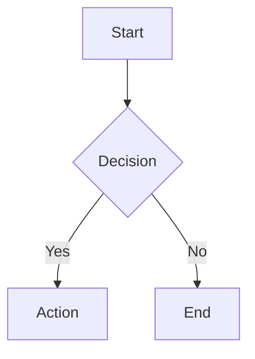

# Obsidian Flavored Markdown Skill

Create and edit Obsidian-compatible Markdown files with Obsidian-specific syntax.

## Basic Formatting

```markdown
# H1   ## H2   ### H3

**bold**  *italic*  ~~strikethrough~~  ==highlight==  `inline code`
```

## Internal Links (Wikilinks)

```markdown
[[Note Name]]                    # Link to note
[[Note Name|Display Text]]       # With alias
[[Note Name#Heading]]            # Link to heading
[[Note Name#^block-id]]          # Link to block
```

## Embeds

```markdown
![[Note Name]]           # Embed full note
![[image.png]]           # Embed image
![[image.png|300]]       # Image with width
![[note#Heading]]        # Embed specific section
```

## Callouts

```markdown
> [!NOTE]
> This is a note callout

> [!WARNING]+ Foldable open by default
> Content here

> [!TIP]- Foldable closed by default
> Content here
```

**Supported types:** `NOTE` `INFO` `TIP` `WARNING` `DANGER` `EXAMPLE` `QUOTE` `ABSTRACT` `SUCCESS` `QUESTION` `FAILURE` `BUG`

## Task Lists

```markdown
- [ ] Unchecked task
- [x] Checked task
- [/] In progress (Obsidian extension)
- [-] Cancelled (Obsidian extension)
```

## Properties (Frontmatter)

```yaml
---
title: My Note
date: 2024-01-15
tags:
  - project
  - important
status: active
aliases:
  - Alternative Name
---
```

**Property types:** `text`, `list`, `number`, `checkbox`, `date`, `datetime`, `aliases`, `tags`

## Tags

```markdown
#tag  #nested/tag  #multi-word-tag
```

## Math (LaTeX)

```markdown
Inline: $E = mc^2$

Block:
$$
\int_0^\infty e^{-x^2} dx = \frac{\sqrt{\pi}}{2}
$$
```

## Diagrams (Mermaid)

````markdown

````

## Footnotes

```markdown
This has a footnote.[^1]

[^1]: The footnote text.
```

## References

- Obsidian Help: https://help.obsidian.md
- Callout types: https://help.obsidian.md/callouts
